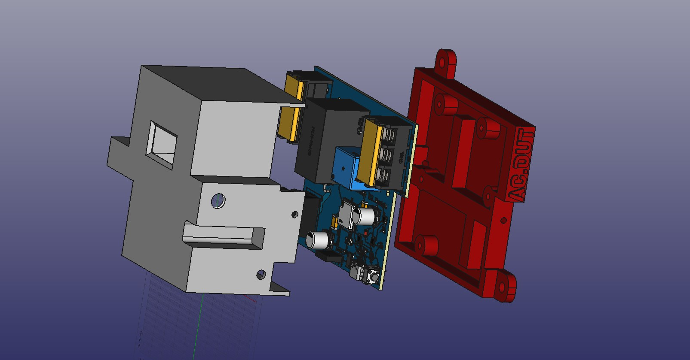
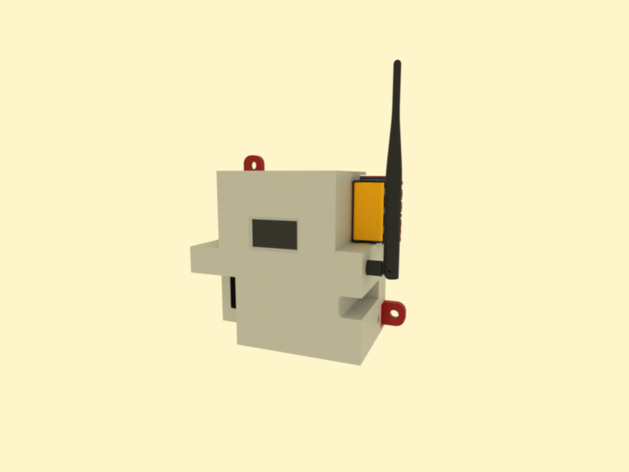

# 3D-Printable Case for SmartSwitch C3 Module

This repository contains the design files for a **simple and functional 3D-printable case** for the **SmartSwitch C3 Module**. The case is designed to be printed in just **two pieces**, making it easy to assemble while providing a clean and professional finish.

### Features:
- **Front Panel**: Includes an opening for a 128x64 display, allowing easy access to critical information at a glance.
- **Button Access**: Precise cutouts for the **manual switch**, **configuration button**, and **WiFi antenna**, ensuring full functionality without disassembling the case.
- **Mounting Points**: Designed with integrated mounting points for securely attaching the PCB and assembling the two halves of the case.
- **Compact and Durable**: Optimized for minimal material use while maintaining durability and a sleek appearance.

This design is ideal for users looking to create a custom enclosure that protects the module while keeping all its features easily accessible. Perfect for DIY enthusiasts and professionals alike!

## Important Disclaimer

> **Disclaimer:**  
This open-source electronics project/device is provided strictly for experimental, educational, and developmental purposes. It is offered "as is," without any warranties, express or implied. This includes, but is not limited to, implied warranties of merchantability, fitness for a particular purpose, or non-infringement.

### By using this device, you acknowledge and accept that:

- You assume all risks associated with its use, including but not limited to potential damage to property, personal injury, or any other unintended consequences.
- This device is not certified for commercial, industrial, or safety-critical applications. It is intended solely for developers, hobbyists, and other users with appropriate technical expertise.
- The creators and distributors of this project are not liable for any damages, losses, or inconveniences resulting from its use, modification, or integration into other systems.

Users are solely responsible for ensuring that the use of this device complies with local laws, regulations, and safety standards in their region.

---

  <h5>Designed in the Dominican Republic 2024-2025</h5>
  

